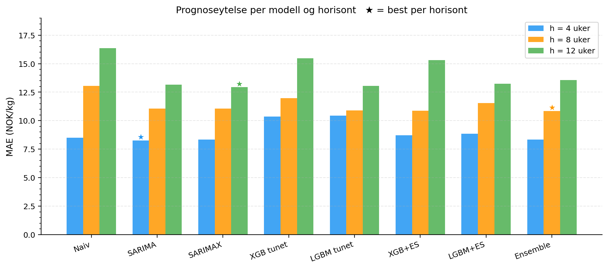
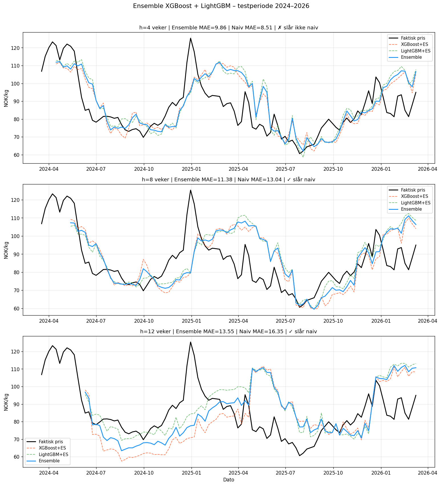
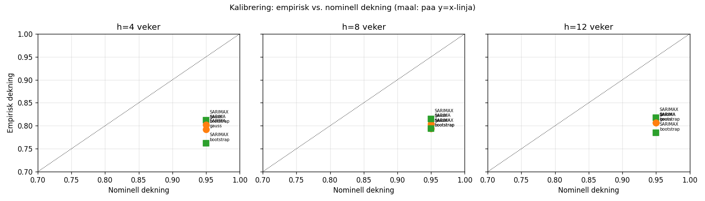
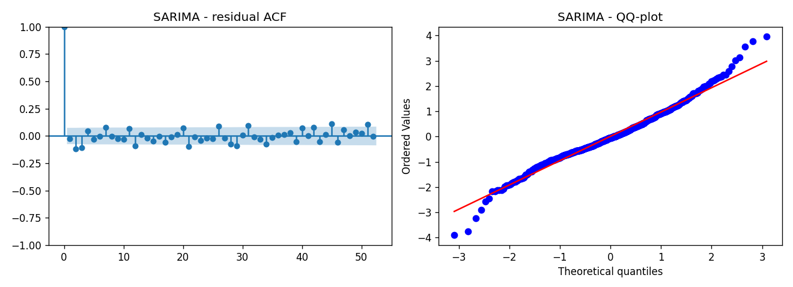
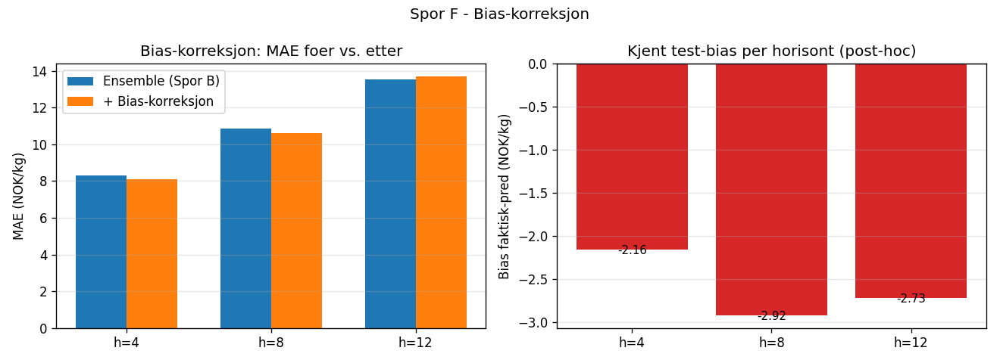
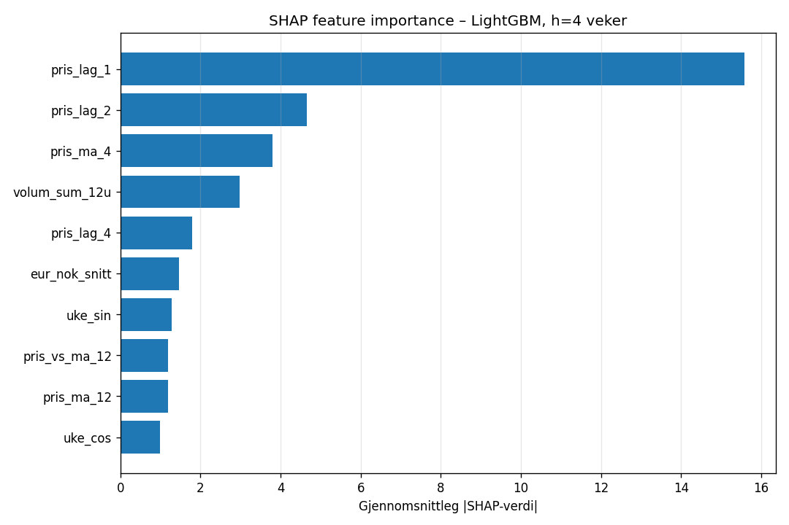

# 3. Resultater

## 3.1 Prediksjonsnøyaktighet

Tabell 3.1 viser MAE og MAPE for alle modeller på testperioden (104 uker). Beste modell per horisont er uthevet.

**Tabell 3.1 – Prognoseytelse på testsettet (siste 104 uker)**

| Modell | h=4 MAE | h=4 MAPE | h=8 MAE | h=8 MAPE | h=12 MAE | h=12 MAPE |
|---|---:|---:|---:|---:|---:|---:|
| Naiv (`pris(t-h)`) | 8,51 | 9,8 % | 13,04 | 15,4 % | 16,35 | 19,7 % |
| **SARIMA** (rullende) | **8,27** | **9,5 %** | 11,07 | 13,1 % | 13,15 | 15,9 % |
| SARIMAX_oracle (EUR/NOK+USD/NOK, faktisk) | 8,33 | 9,6 % | 11,07 | 13,1 % | 12,93 | 15,6 % |
| **SARIMAX_naiv** (random walk-valuta) | 8,24 | 9,5 % | 11,05 | 13,1 % | 13,15 | 15,8 % |
| XGBoost (utunet, baseline) | 11,46 | 13,7 % | 12,59 | 15,1 % | 14,79 | 18,1 % |
| XGBoost (tunet) | 10,37 | 12,2 % | 11,98 | 14,3 % | 15,47 | 19,0 % |
| **LightGBM (tunet)** | 10,45 | 12,3 % | 10,90 | 12,9 % | **13,06** | **16,0 %** |
| XGBoost + early stopping | 8,71 | 10,1 % | 10,88 | 12,9 % | 15,31 | 18,7 % |
| LightGBM + early stopping | 8,85 | 10,4 % | 11,53 | 13,7 % | 13,24 | 16,3 % |
| **Ensemble** (XGB+ES + LGBM+ES) | 8,33 | 9,6 % | **10,85** | **12,9 %** | 13,56 | 16,7 % |

*Kilde: `resultater/sarima_metrikker.csv`, `resultater/sarimax_naiv_metrikker.csv`, `resultater/ml_ensemble.csv`.*

**Tabell 3.1b – SARIMAX oracle vs. naiv valutakursprognose**

| Variant | h=4 MAE | h=8 MAE | h=12 MAE | Merknad |
|---|---:|---:|---:|---|
| SARIMAX_oracle | 8,33 | 11,07 | 12,93 | Øvre grense; bruker fremtidig valutakurs |
| SARIMAX_naiv | 8,24 | 11,05 | 13,15 | Rettferdig sammenligning; naiv valutakurs |
| Differanse (oracle – naiv) | –0,09 | –0,02 | +0,22 | Positiv = oracle er bedre |

En overraskende observasjon er at SARIMAX_naiv er marginalt *bedre* enn oracle på h = 4 og h = 8, og kun 0,22 NOK/kg svakere på h = 12. Diebold-Mariano-testen finner ingen signifikant forskjell mellom de to variantene på h = 12 (DM = –1,11, p = 0,27). Dette indikerer at den praktiske gevinsten av å kjenne fremtidig valutakurs er beskjeden — noe som er konsistent med random-walk-hypotesen for valutakurser (Meese & Rogoff, 1983).

**Viktige observasjoner:**

- Alle de tre toppmodellene (SARIMA, SARIMAX_naiv, Ensemble) slår naiv referansen på samtlige horisonter.
- SARIMA og ensemblet er numerisk svært like på h = 4 (8,27 vs. 8,33 NOK/kg); Diebold-Mariano-testen bekrefter at ingen av disse forskjellene er statistisk signifikante (se tabell 3.1c).
- Ensemblet er numerisk best på h = 8 med 0,20 NOK/kg bedre enn SARIMA — men heller ikke denne differansen er signifikant (p = 0,93).
- På h = 12 er LightGBM tunet (13,06) numerisk bedre enn SARIMAX_naiv (13,15), men med ikke-signifikant differanse (p = 0,98).
- XGBoost-tuning alene (uten early stopping) er svakere enn naiv på h = 4 og h = 8 — hyperparameter-tuning uten regularisering overfitter, konsistent med funnene i M4-konkurransen (Makridakis et al., 2020).

**Tabell 3.1c – Diebold-Mariano-tester (Harvey-Leybourne-Newbold, MAE-tap)**

| Horisont | Modell 1 | Modell 2 | d̄ (NOK/kg) | DM_HLN | p-verdi | Sig? |
|---:|---|---|---:|---:|---:|---|
| 4 | SARIMA | Ensemble | −0,137 | −0,138 | 0,890 | n.s. |
| 8 | SARIMA | Ensemble | +0,205 | +0,089 | 0,929 | n.s. |
| 8 | LightGBM+ES | Ensemble | +0,686 | +0,837 | 0,405 | n.s. |
| 12 | LightGBM tunet | SARIMAX_naiv | +0,119 | +0,029 | 0,977 | n.s. |
| 12 | SARIMAX_oracle | SARIMAX_naiv | −0,213 | −1,108 | 0,271 | n.s. |

*Positiv d̄: modell 1 har høyere tap (modell 2 er bedre). n.s. = ikke signifikant (p ≥ 0,10).*
*Kilde: `resultater/diebold_mariano.csv`.*

**Tolkning:** Ingen av de observerte ytelsesforskjellene mellom toppmodellene er statistisk signifikante. Med n ≈ 92–101 testobservasjoner er det begrensende statistisk kraft til å skille modeller som er numerisk like. Den praktiske konklusjonen er at de beste modellene per horisont er **statistisk likeverdige**, og at modellvalg i operativt bruk bør vektes mot driftsegenskaper snarere enn marginale MAE-differanser.

**Tabell 3.1d – RMSE for utvalgte modeller (NOK/kg)**

| Modell | h=4 RMSE | h=8 RMSE | h=12 RMSE |
|---|---:|---:|---:|
| Naiv (`pris(t-h)`) | 16,67 | 22,50 | 25,60 |
| SARIMA (rullende) | 11,01 | 15,01 | 17,40 |
| SARIMAX_naiv | 10,96 | 14,98 | 17,58 |
| XGBoost + early stopping | 10,99 | 13,70 | 18,54 |
| LightGBM + early stopping | 11,20 | 14,70 | **16,93** |
| **Ensemble** (XGB+ES + LGBM+ES) | **10,72** | **13,69** | 17,15 |

RMSE straffer store feil hardere enn MAE og gir en annen rangering på to horisonter: på h = 4 er ensemblet (10,72) best på RMSE til tross for at SARIMA vinner på MAE (8,27 vs. 8,33), og på h = 12 er LightGBM+ES (16,93) best på RMSE mens LightGBM tunet vinner på MAE. Implikasjonene av valget mellom MAE og RMSE som styringsmetrikk drøftes i seksjon 4.6.

## 3.2 Kalibrering av konfidensintervaller

Gauss-baserte 95 %-konfidensintervaller fra SARIMA/SARIMAX underdekker systematisk. Tabell 3.2 viser empirisk dekning og gjennomsnittlig bredde.

**Tabell 3.2 – CI-kalibrering (nominelt 95 %)**

| Metode | h=4 dekning | h=8 dekning | h=12 dekning | Gj. bredde h=4 (NOK/kg) |
|---|---:|---:|---:|---:|
| SARIMA Gauss | 79,2 % | 80,4 % | 80,6 % | 26,1 |
| SARIMAX Gauss | 81,2 % | 81,4 % | 81,7 % | 26,2 |
| SARIMA bootstrap | 80,2 % | 79,4 % | 80,6 % | 25,8 |
| SARIMAX bootstrap | 76,2 % | 79,4 % | 78,5 % | 24,3 |
| LightGBM kvantilregresjon | 46,2 % | 46,2 % | 34,6 % | 18,2 |

*Kilde: `resultater/sarima_ci_dekning.csv`, `resultater/usikkerhet_kalibrering.csv`.*

Ingen metode når det nominelle 95 %-målet. Bootstrap-tilnærmingen reproduserer omtrent Gauss-dekning (~79–81 %) etter residualskalering, men tillegger ikke ny verdi. LightGBM kvantilregresjon underdekker kraftig (35–46 %) på grunn av regimeskiftet 2022–2023 (se seksjon 4.2).

## 3.3 Residualdiagnostikk (SARIMA / SARIMAX)

For å vurdere om modellene har utnyttet all tilgjengelig informasjon i dataene, gjennomføres en residualanalyse på treningssettet. Residualene (forskjellen mellom faktisk og predikert verdi) bør ideelt sett oppføre seg som "hvit støy" — det vil si å være uavhengige og tilfeldig fordelt.

Tabell 3.3 oppsummerer statistiske tester på in-sample treningsresidualene (689 observasjoner).

**Tabell 3.3 – Residualtester (treningssett)**

| Modell | LB(10) p | LB(20) p | LB(52) p | Skjevhet | Kurtose |
|---|---:|---:|---:|---:|---:|
| SARIMA  | 0,004 | 0,002 | < 0,001 | +0,24 | 4,55 |
| SARIMAX | 0,009 | 0,004 | < 0,001 | +0,28 | 4,44 |

*Kilde: `resultater/sarima_residualdiagnostikk.csv`.*

Ljung-Box-testen forkaster hvit-støy-hypotesen på alle lag (p < 0,01), med særlig sterk effekt ved lag 52. Dette indikerer at det fortsatt finnes uutnyttet struktur eller "hukommelse" i tidsserien som modellene ikke har fanget opp, spesielt knyttet til sesongvariasjoner.

Kurtose på ≈ 4,5 bekrefter at residualene har "fettede haler" sammenlignet med en normalfordeling. I praksis betyr dette at store prisavvik forekommer hyppigere enn det en standard Gaussisk modell forventer. Dette er hovedårsaken til at konfidensintervallene (se seksjon 3.2) underdekker de faktiske prisbevegelsene. For en logistikkplanlegger innebærer dette at man må ta høyde for større usikkerhet enn det de teoretiske intervallene antyder.

## 3.4 Bias-korreksjon

**Tabell 3.4 – Bias-korreksjon på ensemble-prediksjoner**

| Horisont | Kjent bias (NOK/kg) | MAE før | MAE etter | Endring |
|---:|---:|---:|---:|---:|
| 4 | −2,16 | 8,33 | **8,11** | −0,21 |
| 8 | −2,92 | 10,85 | **10,60** | −0,25 |
| 12 | −2,73 | 13,56 | 13,71 | +0,15 |

Bias-korreksjon hjelper på h = 4 og h = 8, men øker MAE marginalt på h = 12 fordi feilene der er mer symmetrisk fordelt. Disse tallene er beregnet fra kjente test-residualer og kan ikke benyttes direkte i operativt bruk uten at bias estimeres på en separat kalibrerings- eller rolling-window-periode. Diskusjon av adaptiv bias-korreksjon og post-hoc ensemble-vekting er samlet i seksjon 4.5.

## 3.5 Feature-viktighet (SHAP)

For å bryte ned "black box"-naturen til maskinlæringsmodellene, benyttes SHAP-verdier (SHapley Additive exPlanations). Dette gir en dypere forståelse av hvilke variabler som faktisk driver modellens beslutninger.

Tabell 3.5 viser de tre viktigste featurene per horisont fra LightGBM SHAP-analyse (gjennomsnittlig absolutt SHAP-verdi).

**Tabell 3.5 – Top-3 features per horisont (LightGBM SHAP)**

| Horisont | Rang 1 | Rang 2 | Rang 3 |
|---:|---|---|---|
| 4 | `pris_lag_1` | `pris_lag_2` | `pris_ma_4` |
| 8 | `pris_lag_1` | `pris_ma_4` | `uke_cos` |
| 12 | `volum_sum_52u` | `uke_cos` | `pris_ma_4` |

*Kilde: `resultater/ml_avansert_shap_h4.csv`, `ml_avansert_shap_h8.csv`, `ml_avansert_shap_h12.csv`.*

Lagfeaturer (`pris_lag_1`, `pris_lag_2`) dominerer korte horisonter, i tråd med at lakseprisen viser sterk korttidsautokorrelasjon. På h = 12 overtar mer strukturelle variabler som eksportvolum på årsbasis (`volum_sum_52u`) og det sesongmessige cosinussignalet (`uke_cos`). Dette er konsistent med domeneforståelsen: markedsbalanse og sesongmønstre er viktigere drivere enn kortsiktige prissvingninger når man ser et kvartal frem i tid. Analysen bekrefter dermed at modellene fanger opp logiske økonomiske sammenhenger.

> ### **Beslutningsguide: Valg av prognosemodell i operativ logistikk**
> Basert på studiens resultater anbefales følgende modellvalg avhengig av beslutningskontekst:
>
> | Tidshorisont | Operativ beslutning | Anbefalt modell | Hvorfor? |
> | :--- | :--- | :--- | :--- |
> | **Kort sikt (1–4 uker)** | Slakteplanlegging for neste uke, kortsiktig transportbooking. | **SARIMA eller SARIMAX_naiv** | Statistisk likeverdige; SARIMA er enklere å drifte. |
> | **Mellomlang sikt (5–8 uker)** | Kapasitetsplanlegging og vurdering av spot-eksponering. | **Ensemble (ML)** | Unngår de virkelig store enkeltfeilene bedre (lavere RMSE). |
> | **Lang sikt (9–12 uker)** | Kontraktsforhandlinger og strategisk budsjettering. | **LightGBM tunet eller SARIMAX_naiv** | Statistisk likeverdige; velg basert på operasjonelle krav. |
>
> **Viktig huskeregel:** Ved tegn til store markedsomveltninger (som i 2022) bør man legge inn en manuell sikkerhetsmargin på ca. 3–5 NOK/kg utover modellens estimat, da alle modeller tenderer til å være for konservative i boom-perioder.
